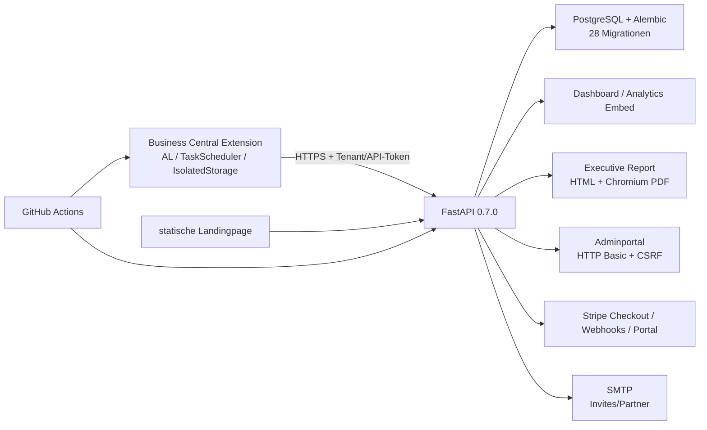

# BCSentinel Go-Live Feature Audit – 10 betreute Pilotkunden

**Auditdatum:** 2026-08-03  
**Entscheidung:** **NO-GO für den ersten externen Pilotkunden auf dem aktuell ausgecheckten Commit**  
**Zielbild:** schnellstmöglicher, kontrollierter Pilot mit maximal zehn aktiv betreuten Kunden; kein Self-Service- oder AppSource-Gate

## 1. Executive Summary

BCSentinel besitzt einen substanziellen, überwiegend automatisiert getesteten Produktkern: tenantgebundene Registrierung, gehashte Backend-Tokens, IsolatedStorage in Business Central, Free-/Assessment-/Validation-/Monitoring-Entitlements, atomare Scan-Credits, Scan-Lifecycle mit Lease/Heartbeat/Recovery, Findings, Dashboard, Adminfunktionen sowie tenantgebundene HTML-/PDF-Reports. Die lokale Testsuite bestätigt 387 Tests; sieben PostgreSQL-Konkurrenztests wurden mangels laufender PostgreSQL-/Docker-Runtime übersprungen.

Der aktuell ausgecheckte Stand `staging@be29fd134465a0e05fdb5eca83c06ffc1e702b66` ist dennoch **kein Release Candidate**. Zwei Page Extensions verwenden die AL-Objekt-ID `53199`; damit scheitern der Source-Uniqueness-Guard und `scripts/validate_bc_extension.py`. Der offene PR #20 auf `origin/release/1.0.2.16` (`023f3a68e0ebdbe51033ddd4cd345c49d2beccf0`, Manifestversion 1.0.2.17) behebt die Kollision und enthält weitere Monitoring-Hotfixes. Für diesen Commit fehlen jedoch ein belegter AL-/CodeCop-/PTECop-Lauf und vor allem die echte BC-Sandbox-Abnahme. PR #15 enthält das Evidence-Gate für genau diese Abnahme, ist aber noch offen und gegenüber `staging` veraltet.

Weitere Pilotblocker sind: kein aktueller realer Install-/Upgrade-/Monitoring-Dry-Run in BC; kein aktueller PostgreSQL Upgrade/Downgrade/Upgrade- und Konkurrenznachweis; kein belegter Backup-/Restore-Test; kein freigegebener, unveränderlicher Release Candidate; keine ausreichende Betriebsüberwachung/Alarmierung; produktive Terminologie- und Preisdrift; sichtbare Landingpage-Artefakte; sowie unvollständige Pilot- und Betriebsdokumentation. SMTP-, Stripe-, DNS-, Steuer-, Rechts- und Produktionskonfiguration sind nur extern prüfbar.

**Schnellster seriöser Weg:** PR #20 als technische Basis festlegen, alle automatisierten Gates darauf ausführen, einen echten BC-27-Sandbox-Dry-Run inklusive Monitoring und Upgrade durchführen, PostgreSQL- und Restore-Gates schließen und den Pilot zunächst manuell freischalten/abrechnen. Stripe ist für einen betreuten Pilot nicht P0; für den ersten regulären Self-Service-Kunden ist der vollständige Live-Prozess P0.

## 2. Geprüfter Branch, Commit und Release-Stand

| Gegenstand | Ergebnis | Bewertung |
| --- | --- | --- |
| Arbeitsbaum | sauber vor Audit; nur diese beiden Auditdokumente werden neu erstellt | keine fremden Änderungen angetroffen |
| Aktueller Branch | `staging`, Tracking `origin/staging` | aktive Entwicklungsbasis, aber kein RC |
| Aktueller Commit | `be29fd134465a0e05fdb5eca83c06ffc1e702b66`, 2026-08-03, `chore: bump BCSentinel extension to 1.0.2.13` | AL-Guard reproduzierbar rot |
| `main` | `28640ee`; 131 Commits hinter und 9 Merge-Commits divergent zu `staging` | nicht Pilotbasis |
| Tags | nur `pre-repo-01a-build-hygiene` | kein versionierter Release-Tag |
| Offene relevante PRs | #15, #17, #18, #19, #20 | mehrere übereinander aufbauende, noch nicht integrierte Releasezweige |
| Neuester funktionaler Releasezweig | `origin/release/1.0.2.16` @ `023f3a6`, Manifest 1.0.2.17 | beste technische Pilotbasis, noch kein freigegebener RC |
| PR #20 | mergeable, 14 Commits, 5 Dateien; Objekt-ID-Fix und Monitoring-Wrapper | vor Pilot integrieren und vollständig gaten |
| PR #15 | reale BC-Sandbox-Evidence-Struktur, mergeable, aber 6 Commits hinter `staging` | rebasen/integrieren oder Runbook manuell verwenden |
| CI-Status über GitHub-Connector | keine Commit-Statuskontexte für `be29fd1`, `023f3a6`, `2cbe862` zurückgegeben | **nicht verifiziert**; Actions UI/Logs manuell prüfen |
| PROD öffentlich | `/health` 200, `/health/ready` 200; OpenAPI 0.7.0 mit 102 Pfaden | erreichbar, Deploymentinhalt nicht commitgenau attestiert |
| DEV öffentlich | `/health` 200; OpenAPI 0.7.0 mit 120 Pfaden | sichtbare PROD/DEV-Drift |

**Empfohlene Pilotbasis:** `023f3a68e0ebdbe51033ddd4cd345c49d2beccf0` nach Integration in einen neu festgelegten RC-Branch/Tag und nach grünen Gates. Diese Empfehlung ist eine Codebasisentscheidung, keine GO-Freigabe.

## 3. Auditumfang und Methode

Geprüft wurden alle getrackten Backend-, AL-, Landingpage-, Infrastruktur-, Workflow-, Migrations-, Test- und Dokumentationsdateien sowie lokale/Remote-Refs und offene PR-Metadaten. Frühere Statusdokumente dienten nur als Suchindex. Statusaussagen unten beruhen auf aktuellem Code, Migrationen, automatisierten Ergebnissen oder ausdrücklich benannten externen Gates.

Statusdefinitionen:

- `VERIFIED`: Code plus erfolgreicher relevanter Test.
- `IMPLEMENTED_NOT_E2E_VERIFIED`: implementiert, aber kein vollständiger realer End-to-End-Nachweis.
- `PARTIAL`: wesentliche Teile vorhanden, mindestens ein notwendiger Teil fehlt.
- `DOCUMENTED_ONLY`: nur Beschreibung/Plan/Runbook.
- `EXTERNAL_MANUAL_CHECK_REQUIRED`: außerhalb des Repositorys zu prüfen.
- `MISSING`: nicht vorhanden.
- `NOT_APPLICABLE`: für den betreuten Pilot nicht erforderlich.
- `BLOCKED`: Prüfung wegen fehlender Runtime/Umgebung nicht ausführbar.

Schätzungen verwenden `C` = Codex-Zeit und `D` = Daniel-Zeit. `h` = Stunden, `d` = Arbeitstage. Externe Wartezeiten sind nicht eingerechnet.

## 4. Architekturübersicht

Zentrale Verträge: `backend/app/core/product_model.py`, `backend/app/services/atomic_scan_start_service.py`, `backend/app/services/scan_status_service.py`, `backend/app/services/access_control_service.py`, `backend/app/routers/billing.py`, `backend/app/services/executive_report_service.py`, `bc-extension/app/src/codeunits/DHApiClient.Codeunit.al`, `DHDeepScanMgt.Codeunit.al`, `DHScanSchedulerMgt.Codeunit.al` und `DHAccessGuard.Codeunit.al`.

## 5. Vollständige Feature-Matrix

Die Bereichsangabe jedes Matrixeintrags ist die jeweilige Unterüberschrift A–J. Sie wird nicht in jeder Tabellenzeile wiederholt. Aufwand, Pilot-Relevanz, Risiko und empfohlene Maßnahme stehen je Eintrag in den entsprechend kombinierten Spalten.

### A. Business-Central-Extension

| Feature | Status | Evidenz | Vorhandene Tests | Fehlender Test | Pilot-Relevanz / Risiko | Maßnahme / Aufwand | Prio |
| --- | --- | --- | --- | --- | --- | --- | --- |
| Installation | IMPLEMENTED_NOT_E2E_VERIFIED | `DHInstall.Codeunit.al`, `app.json` | AL-Vertragstests | frische BC-27-Sandbox-Installation 1.0.2.17 | zwingend; Installationsfehler blockiert Nutzung | RC kompilieren/installieren; C 1h, D 1h | P0 |
| Upgrade | IMPLEMENTED_NOT_E2E_VERIFIED | `DHUpgrade.Codeunit.al`, stabile App-ID | Migrations-/AL-Contracts | echte Upgrades von installierten Pilotversionen auf 1.0.2.17 | zwingend; Daten-/Setupverlust | Upgrade-Matrix mit Evidence; C 2h, D 2–3h | P0 |
| Uninstall/Reinstall | PARTIAL | keine Uninstall-Codeunit; Daten/IsolatedStorage-Verhalten nur Plattformstandard | keine | Uninstall mit/ohne Datenlöschung, Reinstall, Tokenzustand | P1; Support-/Datenschutzrisiko | Sandbox-Test und Anleitung; C 1h, D 1h | P1 |
| Manifest/Objektbestand | BLOCKED | `staging`: Page Extensions 53199 doppelt; PR #20 nutzt 53199/53200/53201 | `Test-ALSourceUniqueness.ps1` FAIL; `validate_bc_extension.py` FAIL | grüner RC-Guard/Compile | P0; aktueller Stand nicht baubar | PR #20 integrieren; C 1h, D 15m | P0 |
| Setup-Seite/Guided Setup | VERIFIED | `DHSetup.Page.al`, `DHGuidedExperience.Codeunit.al` | `test_gl01f_fix01_background_scan`, `Test-GL01FFirstRunUX.ps1` PASS | reale Bedien-/Berechtigungsabnahme | zwingend, mittleres UX-Risiko | Sandbox UAT; C 1h, D 1h | P1 |
| Registrierung | VERIFIED | `DHApiClient`, `DHTenantIdentityMgt`, `/tenant/register` | P0A-, Registration-, Multi-Tenant-Tests PASS | echter BC→PROD/Stage Retry nach Responseverlust | P0 | Sandbox-E2E; C 1h, D 1h | P0 |
| Tenant/Environment/Company-Zuordnung | VERIFIED | stabile Identity-Dimensionen und DB-Constraints | P0A/Multi-Tenant PASS | reale Mehrcompany-Abnahme | P0, hohe Isolation | 2 Companies/2 Environments testen; C 1h, D 1h | P0 |
| sichere Token-Speicherung | IMPLEMENTED_NOT_E2E_VERIFIED | `DHSecretMgt`: `IsolatedStorage`, Scope Company; Backend speichert Hash | Token-/Registration-Tests PASS | BC-IsolatedStorage Upgrade/Reinstall/Permission | P0 | Sandbox-Negativtest; C 30m, D 45m | P0 |
| HTTPS-only API | VERIFIED | `DHApiUrlPolicy`, prod Transport-Middleware, Nginx TLS | P0A Transporttests PASS | Zertifikats-/Proxytest in endgültigem PROD | P0 | externes TLS-Gate; C 30m, D 30m | P0 |
| Permission Sets | IMPLEMENTED_NOT_E2E_VERIFIED | Viewer/Scan/Setup/Admin/Scheduler in `BCSentinelPermissionSets.al` | P0D Quellcontracts PASS | echte Positiv-/Negativtests je Rolle | P0/P1; über- oder unterprivilegierte Nutzer | Sandbox-Rollenmatrix; C 2h, D 2h | P0 |
| Deep Scan / manueller Scan | VERIFIED | `DHDeepScanMgt`, Runner, Dispatcher, Backend `/scan/start`/`sync` | Scan-, P0B/C-, Consolidation-Tests PASS | realer großer Tenant | P0 | Dry-Run; C 1h, D 1–2h | P0 |
| kostenloser Scan | VERIFIED | once-per-tenant, permanente Free-Ergebnisfähigkeiten | GL01F Free, Product Licensing PASS | echter erster Kunde | P0 | Dry-Run; C 30m, D 45m | P0 |
| Assessment | IMPLEMENTED_NOT_E2E_VERIFIED | Alias `full_analysis`→Assessment, 7-Tage-Zugriff | Product Model/Licensing/Billing PASS | Kauf/Freischaltung→BC→Report real | P0 als mindestens ein vollständiger Produktpfad | Pilot manuell freischalten und testen; C 1h, D 1h | P0 |
| Validation Check | VERIFIED | eigener Credit/Ledger/Entitlement | P0B, Licensing, Billing PASS | echter BC-Folgescan | P1 | Dry-Run; C 45m, D 45m | P1 |
| Monitoring-Entitlement | VERIFIED | monthly/annual→Monitoring-Rechte | Entitlement/Licensing PASS | echter Laufzeitablauf | P0 für Monitoring-Pilot | Sandbox/Stage; C 45m, D 45m | P0 |
| manueller Monitoring-Start | BLOCKED | `staging` kollidiert; PR #20 behebt Session-Setup-Reload | Quellcontract auf staging, aber kein 1.0.2.17 Runtimebeleg | echter Start mit Historieneintrag | P0; bekannter Pilotfehler | PR #20 + BC Runtime; C 2h, D 1h | P0 |
| geplanter Background Scan | IMPLEMENTED_NOT_E2E_VERIFIED | BC `TaskScheduler.CreateTask`, Failure Codeunit, Scheduler-Status | GL01F Background Contracts PASS | reale TaskScheduler-Ausführung über Nacht/Fehlerfall | P0 für 10 Piloten | 24h-Sandboxlauf; C 2h, D 2h verteilt | P0 |
| Scan-Status/-Historie | VERIFIED | lokale Run/Finding-Tabellen, Backend RunStatus/Event | Scan Status, Fix05, History Contracts PASS | reale UI-Synchronität bei Abbruch | P0 | Dry-Run Fehlerfall; C 1h, D 1h | P0 |
| Findings / Drilldown / Open in BC | VERIFIED | Finding-Seiten, Dispatcher, Worklists | P0D Direct-Page Guards, GL01C PASS | alle Drilldowns mit echten Datensätzen | P0 | Sandbox-Stichprobe; C 1h, D 1–2h | P0 |
| Dashboard-Aufruf | VERIFIED | Analytics Page/ControlAddIn und Embed Token | Analytics Security/P0D PASS | Browser-in-BC-Frame real | P0 | BC-Webclient-Test; C 30m, D 45m | P0 |
| HTML-/PDF-Report-Aufruf | VERIFIED | `DHApiClient` Report URLs; sichere Backendroutes | Report/P0D PASS | realer Download aus BC | P0 | Dry-Run; C 30m, D 30m | P0 |
| Produktzugriff/abgelaufener Zugriff | VERIFIED | `DHAccessGuard`, frischer Access Snapshot | P0D/Entitlements PASS | Ablauf während geöffneter BC-Seite | P0 | Time-travel/Stage-Test; C 1h, D 45m | P0 |
| Scan Credits | VERIFIED | BC Snapshot + atomarer Backend-Ledger | P0B PASS | PostgreSQL Konkurrenz real lokal derzeit SKIP | P0 | PostgreSQL-Gate; C 1h, D 30m | P0 |
| Data-Health-Ausnahmen | VERIFIED | Exception Table/Mgt/UI, Report count | GL01C/Exception Contract/Report PASS | Debitor/Kreditor/Artikel UAT | P1 | UAT; C 1h, D 1h | P1 |
| DE/EN | PARTIAL | XLIFF 1519 Targets; direkte deutsche AL-Texte vorhanden | Target-Abdeckung; Localization-Script FAIL | BC Runtime DE/EN und globale Bereinigung | P1; sichtbare Sprachmischung | Pilotpfade bereinigen; C 1–2d, D 2h | P1 |
| Fehlermeldungen/Diagnose | PARTIAL | strukturierte Backendcodes, lokale Failure-Felder | Fix03/04/05, Observability PASS | Endnutzer-/Supportabnahme; Telemetrie fehlt | P0/P1 | Fehlerkatalog/Runbook; C 1d, D 2h | P1 |
| Idempotenz/Wiederholbarkeit | VERIFIED | Client Request ID, Run ID, Retry-Vertrag | P0A/B/C/Fix03/04 PASS | Netzwerkfehler real | P0 | Chaosfall im Dry-Run; C 1h, D 1h | P0 |
| Recovery abgebrochener Scans | VERIFIED | Lease/Heartbeat/periodische Recovery | P0C/Fix04/Fix05 PASS | echter BC-Sessionkill + Recovery | P0 | Sandbox-Fehlerfall; C 1h, D 1h | P0 |
| Telemetrie | PARTIAL | Request IDs, Events, lokale Schedulerfelder | Observability PASS | zentraler Alert/Trace, BC-Telemetriesink | P1 bei 10 Kunden | zunächst täglicher manueller Check; C 1–2d, D 30m/Tag | P1 |
| AL Compile / CodeCop / PTECop | BLOCKED | Workflow vorhanden, lokaler Docker/Compiler nicht verfügbar, staging preflight rot | kein aktueller grüner RC-Lauf belegt | 1.0.2.17 Compile + Analyzerlogs | P0 | Actions manuell ausführen/belegen; C 1h, D 30m | P0 |
| AppSourceCop | PARTIAL | Konfiguration/Baseline vorhanden | nicht in aktuellem Lauf | bekannte Baseline + neue Warnungen | P3 Pilot, P0 AppSource | späteres Zertifizierungsgate; C 2–5d, D 1–2d | P3 |

### B. Backend und API

| Feature | Status | Evidenz | Vorhandene Tests | Fehlender Test | Pilot-Relevanz / Risiko | Maßnahme / Aufwand | Prio |
| --- | --- | --- | --- | --- | --- | --- | --- |
| API-Struktur/Versionierung | PARTIAL | FastAPI 0.7.0; gemischte unversionierte und `/api`-Routen | OpenAPI erzeugbar, Routentests | formale v1-Kompatibilitätsstrategie | Pilot gering, Public mittel | bestehende Payloads einfrieren; C 0.5d, D 1h | P2 |
| Tenant-Authentifizierung | VERIFIED | Headerauth, Tokenhash, exakte Tenant-Prüfung | Registration, P0D, Reports PASS | Key-Rotation/Revoke E2E | P0 | manueller Token-Recoveryprozess; C 0.5d, D 1h | P1 |
| Dashboard-Authentifizierung | VERIFIED | PBKDF2-SHA256, JWT-Audience/Scope, HttpOnly/SameSite cookie | Multi-Tenant Dashboard PASS | Brute-force/Lockout, reale Sessionzeit | P0 | Login-Rate-Limit vor breitem Pilot; C 0.5d, D 30m | P1 |
| Tenant-/Company-Isolation | VERIFIED | DB-Abfragen/Tokenclaims gebunden | Multi-Tenant, P0E-Snapshot (lokal SKIP), Report PASS | echter PostgreSQL/Mehrcompany E2E | P0 | PostgreSQL + BC UAT; C 1h, D 1h | P0 |
| Rollen/Berechtigungen | PARTIAL | Dashboard Membership Role gespeichert; wenig serverseitige Rollendifferenzierung | Membershiptests | Owner/Viewer-Aktionsmatrix | P1 | Pilot nur definierte Userrolle; C 1d, D 1h | P1 |
| Registrierung | VERIFIED | idempotenter Upsert, Invite, Rate Limit | P0A/Registration PASS | Produktionsinvite/SMTP real | P0 | Stage-Test; C 30m, D 45m | P0 |
| Queue/Lifecycle | VERIFIED | Start, sync, status, events, reconcile | P0B/C/Fix04/05 PASS | echter BC Worker | P0 | Dry-Run; C 1h, D 1h | P0 |
| atomarer Credit-Verbrauch | VERIFIED | Transaktion, Unique Constraints, Ledger | P0B PASS | 7 PostgreSQL-Tests aktuell SKIP | P0 | CI/PostgreSQL-Gate belegen; C 1h, D 30m | P0 |
| Idempotenz | VERIFIED | Webhook-ID, Start Request, Scan-ID-Verträge | Billing/P0B/C PASS | Stripe CLI Wiederholung real | P0/P1 | Testmode-Replay; C 1h, D 1h | P1 |
| Heartbeat/Lease/Recovery | VERIFIED | `scan_status_service`, Startup + 60s Task | P0C/Fix04 PASS | Prozesskill in Stage | P0 | Chaos-Dry-Run; C 1h, D 1h | P0 |
| Deep-Scan-Verarbeitung | VERIFIED | `/scan/start`, `/scan/sync`, Scoring/Impact | Scan/Product Tests PASS | Last-/Volumentest | P0 | 10-Tenant synthetischer Test; C 1d, D 1h | P1 |
| Findings/Score/KPIs | VERIFIED | Scoring, impact, translation services | Scan, Pricing, Report PASS | fachliche Golden Dataset-Abnahme | P0 | 2–3 Golden Tenants; C 1d, D 1d | P1 |
| Produktmodell/Entitlements | VERIFIED | kanonischer Offer-/Entitlement-Vertrag plus Legacy-Aliase | ARCH-02A/B/C, Licensing PASS | reale Laufzeitmatrix | P0 | Dry-Run aller vier Produkte; C 1d, D 2h | P1 |
| Zugriffsablauf | VERIFIED | Access State/End Dates, frischer Recheck | P0D/Licensing PASS | laufende Sessions bei Ablauf | P0 | Stage-Test; C 1h, D 45m | P0 |
| Monitoring-Scheduler Backend | PARTIAL | Backend recovered Scan-Runs; eigentliche Zeitplanung liegt in BC | Lifecycle Tests | 10 aktive TaskScheduler, Zeit-/DST-Fälle | P0 für 10 | BC-Pilotmonitoring; C 1d, D 2h | P0 |
| Reports/Share Links | VERIFIED | JSON/HTML/PDF; Typ/Scan/Tenant/TTL-Bindung | 12 Reporttests PASS | URL-Leak/Proxylog in PROD | P0 | TTL/Logging manuell prüfen; C 1h, D 30m | P1 |
| Rate Limits | PARTIAL | Registrierung und Partnerauth limitiert | Registration/Partnertests | Dashboardlogin, Billing, Scan, Reports | P1; DoS/Bruteforce | Reverse-Proxy + app limits; C 1d, D 1h | P1 |
| Inputvalidierung | VERIFIED | Pydantic, stabile Registrationcodes, Produktvalidierung | breite API-Suite PASS | Fuzz/Max-Payload | P1 | Limits testen; C 0.5d, D 30m | P2 |
| Fehlerbehandlung/Logging | VERIFIED | strukturierte Handler, Request ID, Redaction | Observability PASS | zentraler Logsink/Alarm | P0/P1 | Betriebsintegration; C 1d, D 1h | P1 |
| Admin-Auditlog | VERIFIED | `admin_audit_events`, alle Kernmutationen loggen | Admin/Pricing/Landing PASS | Unveränderbarkeit/Exportvollständigkeit | P1 | tägliche Review; C 0.5d, D 30m | P1 |
| Health/Readiness | VERIFIED | `/health`, `/health/ready` mit DB-Check | Deployment/Billing PASS; PROD 200 | Alarm auf Readiness | P0 | externen Monitor konfigurieren; C 1h, D 1h | P0 |
| DB-Transaktionen | VERIFIED | Start/Webhook/Registration rollback und Constraints | P0A/B/C/Billing PASS | PostgreSQL E2E | P0 | PostgreSQL-Gate | P0 |
| Alembic-Migrationen | IMPLEMENTED_NOT_E2E_VERIFIED | 28 lineare Migrationen, Head `0028_exception_count` | Membership-/Deploymentmigration PASS | PostgreSQL Upgrade/Downgrade/Upgrade | P0 | isolierte Test-DB; C 2h, D 1h | P0 |
| Backup/Restore | DOCUMENTED_ONLY | `docs/ops/backup-restore.md`; keine Automation im Code/Workflow | keine | echter verschlüsselter Backup+Restore+RTO | P0 | Restore-Dry-Run; C 2h, D 2–3h | P0 |
| Datenschutz/Löschung | PARTIAL | Admin-Tenant-Delete, Scan-Delete; Privacy-Dokumente | Admin Delete PASS | Retention-Automation, Export, rechtliche Freigabe | P1/P0 vor echten Daten | manuelle Pilot-Retention + DPA; C 1d, D 1d | P1 |
| 10 parallele Kunden | BLOCKED | Architektur/Tests vorhanden | SQLite-Suite PASS, PostgreSQL-Konkurrenz SKIP | Lasttest mit PostgreSQL/10 Tenants | P0 für zehnten Kunden | Stage-Lasttest; C 1d, D 1h | P0 |

### C. Dashboard und Kundenportal

| Feature | Status | Evidenz | Vorhandene Tests | Fehlender Test | Pilot-Relevanz / Risiko | Maßnahme / Aufwand | Prio |
| --- | --- | --- | --- | --- | --- | --- | --- |
| Login/Logout/Sessionablauf | VERIFIED | `/dashboard/login`, logout, 60-min JWT cookie | Multi-Tenant Dashboard PASS | Browser-E2E/Idle UX | P0 | Pilotbrowser testen; C 1h, D 1h | P0 |
| Passwort-/Session-Sicherheit | PARTIAL | PBKDF2 210k, HttpOnly/Secure(prod)/Strict, Audience | Tests PASS | Login-Rate-Limit, Lockout, Rotation | P1 | Limit/Runbook; C 0.5d, D 30m | P1 |
| Passwort-Reset | MISSING | nur Invite-Aktivierung; Partner-Reset ist separates System | keine | vollständiger Dashboard-Reset | betreuter Pilot manuell ersetzbar | Admin-Reinvite-Prozess; C 0.5d, D 15m je Fall | P2 |
| Benutzer/Memberships/Rollen | VERIFIED | DashboardUser + Membership, Tenant Switch | Multi-Tenant PASS | Rollen-UX/Verwaltung durch Kunde | P0 | Pilot admin-geführt; C 1h, D 1h | P1 |
| Multi-Tenant-Trennung | VERIFIED | serverseitiger Membership-Recheck/Tokenrotation | Manipulationstests PASS | realer Mehrtenant-Browser | P0 | UAT; C 45m, D 45m | P0 |
| Onboarding/Empty State | PARTIAL | Inviteportal und Fallback/Demo-Guard | Analytics Security PASS | kompletter First-Run ohne Scan | P0 UX | Dry-Run; C 0.5d, D 1h | P1 |
| Health Score/KPIs/Findings | VERIFIED | Analytics Payload/Template/JS | Analytics, Licensing, Localization PASS | echte große Daten | P0 | UAT; C 1h, D 1h | P0 |
| Filter/Sortierung/Trends | PARTIAL | Dashboard JS und Trendpayload | API-/Contracttests | Browser-E2E aller Filter | P1 | Pilot-UAT; C 0.5d, D 1h | P1 |
| Scan-Historie | IMPLEMENTED_NOT_E2E_VERIFIED | API/BC Historie; Dashboard konzentriert auf aktuellen Kontext | History/Status PASS | Browser Journey | P1 | Journey testen; C 1h, D 1h | P1 |
| produktabhängige Sichtbarkeit/Ablauf | VERIFIED | Capability Claims + Backend-Recheck | P0D/Licensing PASS | offenes Browserfenster bei Ablauf | P0 | Stage-UAT; C 1h, D 45m | P0 |
| Report-Downloads | VERIFIED | Reportlinks/API | Reporttests PASS | Browserdownload | P0 | UAT; C 30m, D 30m | P0 |
| Fehlerzustände | PARTIAL | strukturierte API-Fehler, Fallback UI | Contracts | Netzwerk-/5xx-/expired Browser-E2E | P1 | UAT; C 0.5d, D 1h | P1 |
| Responsive | IMPLEMENTED_NOT_E2E_VERIFIED | Dashboard responsive Contract; lokale Landing bei 390 px teils clipping | Dashboard responsive Test | Portal auf realen Geräten | P1 | 390/768/1440 Abnahme; C 2h, D 1h | P1 |
| DE/EN | PARTIAL | JSON Übersetzungen; Legacy-/Premium-Schlüssel bleiben | Localization/ARCH tests PASS | redaktionelle Browserabnahme | P1 | Pilotpfade lektorieren; C 1d, D 2h | P1 |
| Barrierefreiheit | MISSING | keine Axe/WCAG-Suite, nur semantische Teilstruktur | keine | Keyboard/Screenreader/Contrast | P2 im betreuten Pilot | Basischeck; C 1d, D 2h | P2 |
| Support/Kontakt | PARTIAL | statische Supportseiten/Mailadresse | Linkcheck | bestätigter Kanal/SLA | P0 organisatorisch | Pilot-Supportkanal festlegen; C 1h, D 2h | P0 |
| Demo-/Platzhalterdaten | PARTIAL | Demo nur Dev-Flag fail-closed; Landing enthält sichtbare Mockup-/Placeholdertexte | Demo-mode Tests PASS | öffentlicher Content Sweep | Reputationsrisiko | Pilotlink kuratieren; C 1d, D 2h | P1 |

### D. Admin-Backend/Adminportal

| Feature | Status | Evidenz | Vorhandene Tests | Fehlender Test | Pilot-Relevanz / Risiko | Maßnahme / Aufwand | Prio |
| --- | --- | --- | --- | --- | --- | --- | --- |
| Admin-Login | PARTIAL | HTTP Basic, constant-time compare, TLS-Proxy | Adminauth Tests | MFA, Rate Limit, IP-Allowlist | P0 bei kritischen Mutationen | Pilot: VPN/IP-Allowlist + starkes Secret; C 2h, D 1h | P0 |
| CSRF | VERIFIED | Middleware für `/admin/*` POST | negativer CSRF-Test PASS | Proxy/browser UAT | P0 | UAT; C 30m, D 30m | P0 |
| Tenant-/Kundenübersicht | VERIFIED | Admin Templates/Routes | Admin PASS | 10-Tenant UX | P0 Support | Seed/UAT; C 1h, D 1h | P1 |
| Benutzerverwaltung | PARTIAL | Membership/Invite indirekt; keine vollständige Dashboard-User-UI | Tests auf Invite/Membership | Admin CRUD/Disable UX | Pilot manuell/DB-frei eingeschränkt | Reinvite/disable Runbook; C 0.5d, D 1h | P1 |
| Produktzuweisung/Credits | VERIFIED | Grant/Revoke/Add/Remove/Reset | Admin PASS | echter Pilotflow | P0 als Stripe-Ersatz | UAT; C 45m, D 45m | P0 |
| Monitoring/Ablauf/Lizenzreset | VERIFIED | Enable/Disable/Extend/Reset | Admin PASS | BC Snapshot-Sync real | P0/P1 | Dry-Run; C 1h, D 1h | P0 |
| Invite/Registrierung | PARTIAL | Re-registration Reset dev-only; Invite send/resend | Registration/Admin Tests | PROD-Recovery ohne direkte DB | P0 Support | dokumentierter sicherer Recoverypfad; C 0.5d, D 1h | P0 |
| Scan-/Fehlerdiagnose | PARTIAL | Runs/Status im Tenant Detail, Request IDs | Status/Admin Tests | zentrale Suche/Alerting/Export | P0 Betrieb | tägliche Query/Checkliste; C 0.5d, D 30m/Tag | P0 |
| Payment/Stripe-Zuordnung | PARTIAL | Subscription/Invoice/Purchase-Daten sichtbar | Billing Tests | Testmode/Live UAT, Reconciliation UI | Pilot manuell möglich | manuelles Kontrollblatt; C 0.5d, D 1h | P1 |
| manuelle Korrekturen | VERIFIED | Produkt, Credits, Monitoring, Access, Reset | Admin Tests | Vier-Augen-/Freigabeprozess | hohes Missbrauchsrisiko | Pilot-Auditreview; C 1h, D 30m/Woche | P1 |
| Auditierbarkeit | VERIFIED | AdminAuditEvent bei Kernmutationen | Admin/Pricing PASS | unveränderbarer externer Logexport | P1 | wöchentlicher Export/Review; C 0.5d, D 30m | P1 |
| Schutz kritischer Aktionen | PARTIAL | CSRF/Basic/Bestätigungsmeldungen | Admin Tests | MFA, Step-up, IP-Allowlist aktiv | P0 Security | Proxy-Allowlist/VPN; C 2h, D 1h | P0 |
| Export/Supportinformationen | PARTIAL | Partner CSVs, kein vollständiges Tenant-Supportbundle | Tests partiell | Tenantdiagnoseexport | P2 | später; C 1d, D 1h | P2 |

### E. Executive Reports

| Feature | Status | Evidenz | Vorhandene Tests | Fehlender Test | Pilot-Relevanz / Risiko | Maßnahme / Aufwand | Prio |
| --- | --- | --- | --- | --- | --- | --- | --- |
| Free/Assessment/Validation/Monitoring Report | PARTIAL | ein gemeinsamer Executive-Report mit Produktzugriff; keine klar getrennten vier Templates | Report/Licensing PASS | fachliche Variantenmatrix | P0: mindestens Free+bezahlter Pfad | Pilotvarianten UAT; C 1d, D 2h | P1 |
| HTML | VERIFIED | Jinja Template/CSS | Reporttests PASS | reale Browsermatrix | P0 | Stage UAT; C 1h, D 1h | P0 |
| PDF | VERIFIED | Playwright Chromium mit Fallback | Reporttests; getracktes 2-Seiten-Chromium-PDF visuell geprüft | aktueller RC-Container, große Findingsmenge | P0 | Image/Stage Render; C 1h, D 1h | P0 |
| Dashboard-/HTML-/PDF-Datenkonsistenz | VERIFIED | gemeinsamer Reportbuilder/Scanmodell | JSON/HTML/PDF Test PASS | echter Kunde | P0 | Dry-Run Screenshotvergleich; C 1h, D 1h | P0 |
| Score/KPI/Severity/finanzieller Impact | VERIFIED | Builder/Template, Score/Impact Services | Report/Scoring Tests PASS | fachliche Golden Results | P0 | Daniel fachliche Freigabe; C 1d, D 1d | P0 |
| Findings/Empfehlungen | IMPLEMENTED_NOT_E2E_VERIFIED | ReportFinding/Priority Items, Free-Redaktion | Tests | große/Sonderzeichen-Daten | P1 | Edge-Dataset; C 0.5d, D 1h | P1 |
| Branding/Layout/Druck | VERIFIED | 2 A4-Seiten, lokale Fonts, Footer 01/02 | existierender Chromium-Render visuell ohne Überlauf geprüft | aktueller 1.0.2.17/Containerrender | P0 | finalen RC rendern; C 1h, D 30m | P0 |
| große Zahlen/Sonderzeichen | IMPLEMENTED_NOT_E2E_VERIFIED | `money-long`, UTF-8, Edge-Case Test | String-/CSS-Test PASS | echter Chromium-Render der >1 Mio.-Variante | P1 | Render/Screenshot; C 1h, D 30m | P1 |
| DE/EN | VERIFIED | Builder Labels/Template | German/English tests PASS | redaktionelle UAT | P1 | beide PDFs sign-off; C 1h, D 1h | P1 |
| sichere Links/TTL/Tenant-Schutz | VERIFIED | typ-/scan-/tenantgebundene Tokens + Recheck | Share/Expiry/Isolation PASS | Proxylogs/Referrer real | P0 | PROD-Logging prüfen; C 1h, D 30m | P0 |
| Erzeugung aus BC | IMPLEMENTED_NOT_E2E_VERIFIED | AL öffnet API-Routen | Access Contracts | echter BC-Download | P0 | Dry-Run; C 30m, D 30m | P0 |
| E-Mail-Versand Report | MISSING | kein Reportmail-Event | keine | SMTP/PDF-Link-Flow | im betreuten Pilot manuell ersetzbar | Support sendet Link manuell; D 5m/Report | P2 |
| Terminologie | PARTIAL | getrackter PDF-Render und Fallback enthalten „Vollständige Analyse“, „Premium“, „Full Analysis“ | ARCH-Test deckt nur Teile | kompletter Output-Sweep | P1/Reputation | auf Assessment angleichen; C 0.5d, D 1h | P1 |

### F. Landingpage

| Feature | Status | Evidenz | Vorhandene Tests | Fehlender Test | Pilot-Relevanz / Risiko | Maßnahme / Aufwand | Prio |
| --- | --- | --- | --- | --- | --- | --- | --- |
| Start/Leistung/CTA | PARTIAL | `landingpage` und `landingpage_neu` parallel; Nginx zeigt `landingpage` | lokaler Link-/Browsercheck | kanonische deployte Quelle | P1 | eine Pilot-Landingquelle festlegen | P1 |
| Produktmodell/Preise | PARTIAL | 79/49/149/1490 sichtbar, aber „Full Analysis/Premium“ und Tierpreise im Backend | Pricing/ARCH Tests | End-to-End-Konsistenz mit Stripe/DB | P1 Pilot, P0 Self-Service | Copy/Preisvertrag schließen; C 1d, D 2h | P1 |
| Kauf/Registrierung | PARTIAL | CTAs, Checkout aus BC/Analytics; statische Seite führt teils Kontakt | Billing Tests | Browser→Kauf→Aktivierung | betreuter Pilot manuell möglich | Pilot-CTA auf Kontakt/Einladung | P2 |
| Dashboard-Login/Dokumentation/Kontakt | VERIFIED | lokale Seiten und Links vorhanden | lokaler Linkcheck: 0 fehlende Links/Assets | öffentlicher UAT | P1 | Smoke; C 1h, D 1h | P1 |
| Impressum/Datenschutz/Terms | PARTIAL | Seiten vorhanden; Datenschutz enthält `[Telefonnummer]`, vorläufige Rechtsformulierungen | Linkcheck | juristische Freigabe | P0 vor öffentlicher Akquise/zahlendem Self-Service | Daniel/Rechtsberatung; D 1–3d | P1 |
| Widerruf/B2B/Vertragsbedingungen | PARTIAL | Terms/EULA vorläufig | keine | Rechtsprüfung | regulär zahlender Kunde P0 | B2B-Vertrag/Pilotvereinbarung | P1 |
| Cookie/Tracking | PARTIAL | kein offensichtliches Tracking-SDK im Pilotpfad; externe Fonts/Forms in Content erwähnt | Quellscan | deployed Header/Requests/Consent | extern | Network-/Legal-Check; C 1h, D 2h | P1 |
| DE/EN | PARTIAL | Umschalter/JSON | i18n-Contract; Browser DE | redaktionelle Vollprüfung | P1 | Copy-Sweep | P1 |
| SEO | PARTIAL | Titel/Metadaten in statischen Seiten | keine Lighthouse-Suite | Canonical/OpenGraph/Sitemap/robots deployt | P3 Pilot | später; C 1d | P3 |
| Mobile | PARTIAL | global kein Horizontal-Scroll bei 390 px; interne Clipping-Befunde in Impact/Pricing | lokaler Browseraudit | Geräte-/Touchabnahme | P1 | CSS Pilotpfad korrigieren; C 0.5d, D 30m | P1 |
| Performance | BLOCKED | statische Assets klein; keine Lighthouse-/RUM-Evidenz | keine | öffentliches Lighthouse | P2 | später/Stage; C 2h | P2 |
| fehlerhafte Links | VERIFIED | beide Landing-Verzeichnisse: 0 fehlende lokale href/src-Ziele | lokaler statischer Check | externe Zielverfügbarkeit | P1 | externes Smoke; C 30m, D 30m | P1 |
| Platzhalter/Claims | PARTIAL | sichtbare `EUR-`, Mockup-Hinweise, `[Telefonnummer]`; `landingpage_neu` behauptet Verfügbarkeiten 99.98/99.99 % | Browser/Quellscan | Legal/Marketing-Signoff | Reputations-/Irreführungsrisiko | aus Pilotpfad entfernen; C 0.5–1d, D 2h | P1 |
| Deploymentkonsistenz | PARTIAL | PROD/DEV 200, aber unterschiedliche HTML/Path-Umfänge; Docker kopiert `landingpage`, Service referenziert auch `landingpage_neu` | öffentliche Health/OpenAPI-Checks | commitgenaue Deploy-Metadaten | P0 Betrieb | Release SHA exponieren/attestieren; C 0.5d, D 1h | P0 |

### G. Stripe und kommerzieller Prozess

| Feature | Status | Evidenz | Vorhandene Tests | Fehlender Test | Pilot-Relevanz / Risiko | Maßnahme / Aufwand | Prio |
| --- | --- | --- | --- | --- | --- | --- | --- |
| Test-/Live-Mode | EXTERNAL_MANUAL_CHECK_REQUIRED | Secret-/Price-ID-Settings vorhanden | Mocktests | Stripe Dashboard Test+Live-Konfiguration | Pilot manuell ersetzbar | Daniel prüft Konten/Keys getrennt | P1 |
| Produkte/Prices | PARTIAL | vier Produkte/Price IDs; DB-Tiermatrix weicht vom erwarteten Fixpreisbild ab | Pricing/Billing PASS | Stripe-Objekte und Beträge | Preis-/Vertragsrisiko | kanonischen Preisvertrag sign-off; C 1d, D 2h | P1 |
| Checkout/Success/Cancel | VERIFIED | sichere URLs, Payment vs Subscription | Billing PASS | Stripe Testmode Browser-E2E | Self-Service P0, Pilot P2 | Testmode-Dry-Run; C 2h, D 1h | P2 |
| Webhook-Signatur | VERIFIED | `stripe.Webhook.construct_event`, in PROD Pflicht | valid/invalid Tests PASS | Stripe CLI/Testmode | P1 | Replay-Test | P1 |
| Webhook-Idempotenz/Mehrfachzustellung | VERIFIED | unique event record/processed flag | Billing PASS | verzögerte Reihenfolge Testmode | P1 | Stripe CLI Matrix | P1 |
| Purchase/Credit/Productaktivierung | VERIFIED | Purchase/Entitlement/Credit Services | Billing/Product Licensing PASS | realer Kauf→BC Snapshot | Pilot manuell alternativ | Testmode oder Admin-Grant | P1 |
| Verlängerung/Kündigung/Zahlungsfehler | IMPLEMENTED_NOT_E2E_VERIFIED | Subscription + invoice events, Portal | Billing-Unitfälle teilweise | Testclock/Dunning/Grace-Period E2E | zahlender Kunde P0 | Stripe Test Clock; C 1d, D 2h | P1 |
| Refund/Chargeback/Dispute | MISSING | keine `charge.refunded`/`refund`/`dispute` Handler | keine | gesamter Prozess | zahlender Kunde P0, Pilot manuell | Runbook + später Handler; C 1–2d, D 2h | P2 |
| Statussynchronisierung/Recovery | PARTIAL | Session Status Sync, Webhooklog, Adminsicht | Billing PASS | periodische Reconciliation/Retry UI | P1 | tägliche manuelle Reconciliation | P1 |
| Stripe Customer↔Tenant | IMPLEMENTED_NOT_E2E_VERIFIED | Metadata/Subscription lookup | Billing PASS | echte Kunden-/Mergefälle | P1 | Testmode | P1 |
| Rechnungen/Steuer/USt | EXTERNAL_MANUAL_CHECK_REQUIRED | Invoice-Datenspeicher; keine Tax-Logik | Mocktests | Stripe Tax, Rechnungsangaben, USt-ID | zahlender Kunde P0 | Steuerberater/Stripe-Konfiguration | P1 |
| Logging ohne Zahlungsdaten | PARTIAL | strukturierte Events; Roh-Webhook-Payload wird gespeichert | Redaction allgemein | Datenschutz-/Retentionreview des Payloads | P1 Datenschutz | Payload minimieren/Retention festlegen | P1 |
| Kauf-bis-Nutzung E2E | BLOCKED | Komponenten vorhanden | Mocktests | Stripe Testmode + BC Runtime | nicht P0 bei manueller Freischaltung | vor Self-Service schließen | P2 |

**Reifegradtrennung Stripe:** Code vorhanden und mockgetestet; Stripe-Testumgebung, Live-Vorbereitung und Produktion sind im Audit nicht verifiziert. Für den betreuten Pilot wird Stripe durch dokumentierte Admin-Freischaltung und manuelle Rechnung ersetzt.

### H. E-Mail-Versand

| Feature | Status | Evidenz | Vorhandene Tests | Fehlender Test | Pilot-Relevanz / Risiko | Maßnahme / Aufwand | Prio |
| --- | --- | --- | --- | --- | --- | --- | --- |
| Einladung/Dashboardzugang | IMPLEMENTED_NOT_E2E_VERIFIED | SMTP, DE/EN Templates, resend | Registration/Invite Tests | echter Provider/Inbox/Retry | P0, manuell ersetzbar | SMTP-Test oder Link sicher über Pilotkanal | P0 |
| Registrierung/Welcome | MISSING | keine separaten Events | keine | Mailflow | manuell | Pilot-Welcome-Vorlage; C 1h, D 5m/Kunde | P1 |
| Kaufbestätigung/Aktivierung | MISSING | Stripe aktiviert DB, keine Mail | keine | Mailflow | manuell | Supportvorlage; C 1h, D 5m/Kauf | P1 |
| Scan gestartet/abgeschlossen/fehlgeschlagen | MISSING | keine Mailaufrufe in Scanpfaden | keine | Mailflow | fehlgeschlagen ist P0-Kommunikation, automatisiert nicht P0 | täglicher Monitor + manuelle Mail | P1 |
| Report verfügbar | MISSING | kein Versand | keine | Mailflow | manuell | Link aus Supportkanal | P2 |
| Monitoring-Ergebnis/Adminwarnung | MISSING | keine Notification Pipeline | keine | Mailflow | P0 Betrieb bei 10 Kunden | zentrale tägliche Kontrolle, Fehlalarm manuell | P0 |
| Zahlungsfehler/Kündigung/Ablauf | MISSING | keine Billingmails | keine | Mailflow | zahlender Self-Service P0 | vor Self-Service implementieren | P2 |
| Provider/SPF/DKIM/DMARC | EXTERNAL_MANUAL_CHECK_REQUIRED | generisches SMTP konfigurierbar | keine | DNS/Providerzustellung | Einladung P0 | Daniel DNS/Inbox-Test | P0 |
| Templates/Branding/DE/EN | PARTIAL | Invite/Partner/Admin-Testtemplates | Template Tests indirekt | alle Transaktionsarten | P1 | Pilotvorlagen finalisieren | P1 |
| Retry/Bounce/Dedupe/Logging/Opt-out | MISSING | synchrones SMTP, kein Queue-/Bounce-System | keine | Zustellbetrieb | Pilot manuell tragbar, Public P0 | Supportlog; später Provider-Webhooks | P2 |

**Für den Pilot unverzichtbar:** sichere Zugangseinladung, Scanfehler-/Monitoring-Fehler-Warnung an den Betreiber und klare Onboarding-/Supportkommunikation. Diese dürfen für zehn betreute Kunden zunächst manuell erfolgen, müssen aber mit Checkliste, Verantwortlichem und täglicher Kontrolle belegt sein.

### I. Dokumentation und Pilot-Onboarding

| Feature | Status | Evidenz | Vorhandene Tests | Fehlender Test | Pilot-Relevanz / Risiko | Maßnahme / Aufwand | Prio |
| --- | --- | --- | --- | --- | --- | --- | --- |
| Installation/Upgrade | PARTIAL | Release-/CAT-/Upgrade-Dokumente | keine aktuelle Nutzerprobe | 1.0.2.17 Schrittfolge/Screenshots | P0 | konsolidierte Pilot-Anleitung | P0 |
| QuickStart/Free Scan | MISSING | kein als QuickStart identifizierbares Dokument | keine | Nutzerprobe | P0 | 1–2 Seiten erstellen; C 0.5d, D 1h | P0 |
| Registrierung | PARTIAL | CAT/Runbooks | Contracttests | aktueller Screenshot/Fehlerpfad | P0 | in QuickStart integrieren | P0 |
| Assessment kaufen/verwenden | MISSING | Preis-/Billingdocs, kein Kundenguide | keine | Pilotablauf | Pilot manuell freischaltbar | Adminfreischaltung dokumentieren | P0 |
| Validation Check | PARTIAL | CAT/Billingmatrix | Tests | Kundenschritte | P1 | Kurzguide | P1 |
| Monitoring/TaskScheduler | PARTIAL | CAT/Runbooks | Contracts | 1.0.2.17 Screenshots und 24h-Lauf | P0 | Pilotguide + Evidence | P0 |
| Dashboard/Findings/Reports | PARTIAL | Landingdocs, CAT, Exceptions Guide | Linkchecks | aktuelle Screenshots/Benutzerprobe | P0 | QuickStart-Kapitel | P0 |
| Data-Health-Ausnahmen | VERIFIED | `DH_EXCEPTIONS_USER_ADMIN_GUIDE.md` | GL01C Tests | Nutzerprobe | P1 | UAT | P1 |
| Benutzer/Berechtigungen | PARTIAL | Rollenmatrix | Source Contracts | Sandboxrolle | P0 | Pilot-Rollenblatt | P0 |
| Deinstallation | PARTIAL | CAT erwähnt Verhalten | keine | echte Durchführung | P1 | Runbook | P1 |
| Troubleshooting/FAQ | PARTIAL | mehrere technische Audits, kein kompakter Pilot-Troubleshooter | keine | Supportprobe | P0 | Top-10 Fehler + Request ID | P0 |
| Datenschutz/Datenverarbeitung | PARTIAL | Processing/Retention/DPA-Checkliste | keine | Rechts-/Kundenfreigabe | P0 vor echten Daten | Daniel finalisiert DPA | P0 |
| Supportprozess | PARTIAL | Pilot Runbook | keine Übung | Kontakt, SLA, Eskalation | P0 | verbindlich festlegen | P0 |
| Pilot-Onboarding-Checkliste | PARTIAL | Pilot-/Go-Live-Runbooks | keine | vollständiger Dry-Run | P0 | konsolidieren | P0 |
| Pilot-Abnahmeprotokoll | MISSING | Evidence-PR #15 offen, kein fertiges Kundenprotokoll im Branch | Contract nur in PR | signierbares Protokoll | P0 | Template erstellen | P0 |
| Admin-Betriebshandbuch | MISSING | technische Einzeldokumente | keine | Operatorprobe | P0 | 10-Kunden-Runbook | P0 |
| Backup/Restore | DOCUMENTED_ONLY | `docs/ops/backup-restore.md` | keine | echter Restore | P0 | testen und Werte eintragen | P0 |
| Incident/Release/Rollback | PARTIAL | Deployment/Release/Pilot-Runbooks | keine Übung | Drill und letzte Version | P0 | Dry-Run | P0 |
| bekannte Einschränkungen | MISSING | verteilt in Audits, nicht kundenlesbar | keine | Signoff | P0 Transparenz | kompakte Liste | P0 |

### J. Betrieb, Sicherheit und Support

| Feature | Status | Evidenz | Vorhandene Tests | Fehlender Test | Pilot-Relevanz / Risiko | Maßnahme / Aufwand | Prio |
| --- | --- | --- | --- | --- | --- | --- | --- |
| DEV/STAGING/PROD | PARTIAL | DEV/PROD Compose; kein klar separates Staging-Deployment | öffentliche DEV/PROD Health 200 | commitgenaue Umgebungsinventur | P0 | RC→Stage→Prod-Prozess | P0 |
| Secret Management | PARTIAL | Env-Settings/GitHub Secrets; `.env.dev` ignoriert | keine Secrets getrackt nach Dateinamen | Serverrechte/Rotation/Vault | P0 | Daniel prüft Rechte/Rotation | P0 |
| HTTPS/Sicherheitsheader | VERIFIED | Nginx TLS, App CSP/HSTS/XFO | Header/Transporttests PASS | öffentliches TLS/Header-Scan | P0 | extern prüfen | P0 |
| Backups/Restore | DOCUMENTED_ONLY | Runbook, Volume | keine | Restoretest/RPO/RTO | P0 | vor Kunde | P0 |
| Monitoring/Alerting/Errortracking | MISSING | Health und Logs, aber kein externer Monitor/Sentry/Prometheus/Alarmworkflow | Healthtests | Alarmzustellung | P0 | Uptime+Readiness+Logalarm | P0 |
| Logrotation/Speicherplatz | MISSING | kein Compose-/Host-Nachweis | keine | Hostprüfung | P1 bei 10 | Docker/Host Limits dokumentieren | P1 |
| Container-Restart | IMPLEMENTED_NOT_E2E_VERIFIED | `restart: unless-stopped`, healthcheck | Compose config dev/P0E PASS | Kill-/Reboot-Test | P0/P1 | Stage-Test | P1 |
| Deployment | PARTIAL | GitHub Action deployt main/staging via SSH und destruktivem clean auf Server | YAML/Healthpfad | aktuelle Actions-Evidenz, Schutzregeln | P0 | manuelles RC-Gate vor Push | P0 |
| Rollback | DOCUMENTED_ONLY | Runbooks, kein automatisierter DB/App Rollback | keine | Restore/previous image | P0 | Drill | P0 |
| Migrationen | IMPLEMENTED_NOT_E2E_VERIFIED | Deploy führt upgrade head aus | Tests/Head PASS | PostgreSQL U/D/U | P0 | Test-DB-Gate | P0 |
| Releaseartefakt/BC-Download | PARTIAL | getrackte `.app` bis 1.0.2.13; kein 1.0.2.17-Artefakt/Signatur | kein aktueller Compile | reproduzierbares RC-Artefakt/Hash | P0 | CI-Artefakt erzeugen | P0 |
| Verfügbarkeit/Performance | BLOCKED | Health online; keine SLO-/Lastdaten | keine | 10-Tenant Last/SLA | P0 für zehnten Kunden | Last-/Soaktest | P0 |
| Dependency Security | BLOCKED | gepinnte Requirements; `pip check` PASS; kein lokaler pip-audit/trivy | Konsistenz PASS | CVE/SBOM/Image Scan | P1 | CI pip-audit + image scan | P1 |
| Datenschutz/DPA/Retention | PARTIAL | DPA-/Processing-/Retentiondocs | Delete Test | Rechtsfreigabe + technische Retention | P0/P1 | Pilotvereinbarung/manuelle Retention | P0 |
| Support/SLA/Incidentkommunikation | PARTIAL | statische Supportangaben und Runbooks | keine Übung | bestätigte Erreichbarkeit/Vertretung | P0 | Daniel legt Kanal/Zeiten/Eskalation fest | P0 |
| manuelle 10-Kunden-Abläufe | PARTIAL | Adminfunktionen ermöglichen Freischaltung/Korrektur | Admin Tests | Kapazitätsprobe/Checkliste | P0 | tägliches Cockpit + Wochenreview | P0 |

## 6. Testübersicht

| Kommando/Prüfung | Ergebnis | Einordnung |
| --- | --- | --- |
| `backend\.venv\Scripts\python.exe -m pytest --collect-only -q` | PASS: 394 Tests gesammelt | Inventar |
| `backend\.venv\Scripts\python.exe -m pytest -p no:cacheprovider -q` | PASS: 387; SKIP: 7; 89 Warnungen; 196,49 s | breite Unit/API/Contract-Suite |
| `... pytest -q -rs tests\test_p0e_postgres_concurrency.py` | SKIP: 7, explizit „requires real PostgreSQL locking semantics“ | kein PostgreSQL-Nachweis |
| `alembic heads` | PASS: ein Head `0028_exception_count` | Graph konsistent |
| Alembic Upgrade/Downgrade/Upgrade | BLOCKED: kein PostgreSQL/psql; Docker Engine nicht aktiv | P0 offen |
| `docker compose -f docker-compose.dev.yml config --quiet` | PASS mit Env-Warnungen | Syntax |
| `docker compose -f docker-compose.p0e.yml config --quiet` mit Audit-Platzhaltern | PASS | Syntax |
| PROD Compose Config | BLOCKED: `.env.prod` absichtlich nicht lokal vorhanden | externes Gate |
| Docker Build/Compose Runtime | BLOCKED: Docker Engine nicht aktiv | kein Image-/Postgreslauf |
| `Test-ALSourceUniqueness.ps1` | FAIL: doppelte Page Extension ID 53199 | Releaseblocker auf staging |
| `Test-GL01CDHExceptions.ps1` | PASS: 7 Contracts | AL-Ausnahmen |
| `Test-GL01FFirstRunUX.ps1` | PASS | Setup/First Run Contracts |
| `scripts/validate_bc_extension.py` | FAIL: doppelte AL-ID | Releaseblocker |
| `scripts/check_al_localization.py` | FAIL: 24 Befunde in `DHSalesLineIssueWorklist.Page.al` | P1 Pilot-UX |
| XLIFF XML/Targets | PASS: 1519 DE-Targets für 1519 DE-Units | formale Targetabdeckung, keine Sprachqualität |
| `scripts/check_pricing_consistency.py` mit isolierter Testkonfiguration | PASS: Landing-Snapshot und Backend-Fallbacks stimmen überein | beweist keine DB-Tier-/Stripe-Live-Konsistenz |
| `pip check` | PASS | keine gebrochenen Python-Abhängigkeiten |
| CVE/Image Scan | BLOCKED: kein lokales Audittool/Docker | P1 offen |
| lokaler Landing-Link-/Assetcheck | PASS: 0 fehlende lokale Ziele in beiden Landing-Verzeichnissen | keine externen/inhaltlichen Aussagen |
| lokaler Chromium-Browseraudit | PASS Konsole/Globaloverflow; FAIL sichtbare `EUR-`, Legacycopy und interne 390px-Clipping-Befunde | P1 |
| getrackter Report-PDF-Render | PASS: 2 A4-Seiten, Footer 01/02, visuell kein Überlauf; Terminologie veraltet | aktueller RC-Render noch offen |
| öffentliche PROD/DEV Health | PASS: HTTP 200; PROD ready DB ok | Erreichbarkeit, keine Business-E2E-Evidenz |
| `git diff --check` | PASS nach Dokumenterstellung | keine Whitespacefehler |

Warnungen der Vollsuite: Starlette `TemplateResponse`-Deprecations und python-jose `datetime.utcnow()`-Deprecations. Kein Pilotblocker, aber P2-Technikschuld.

## 7–16. Bereichsbewertungen

### 7. BC-Extension

Codekern und Zugriffsschutz sind stark, aber der ausgecheckte Branch ist nicht baubar und der letzte bekannte echte Monitoringfehler ist nur auf einem offenen Releasezweig korrigiert. Ohne echten BC-27-Compile, Rollen-, Install-, Upgrade-, manuellen Monitoring- und TaskScheduler-Test bleibt die Extension P0-blockiert.

### 8. Backend/API

Der Backendkern hat die höchste nachweisbare Reife. Tenant-Isolation, Starttransaktionen, Lifecycle und Access-Rechecks sind gut getestet. P0 bleiben reale PostgreSQL-Semantik, Upgrade-/Restore-Beweis, Last-/Soaktest und produktiver Alertingbetrieb.

### 9. Dashboard/Portal

Login, Multi-Tenant-Membership und Capability-Schutz sind implementiert und getestet. Für den Pilot fehlen Browser-E2E, Login-Bruteforce-Schutz und ein manueller Passwort-Recoveryprozess. Ein vollwertiges kundenseitiges User-Management ist nicht nötig, solange Daniel Onboarding und Reinvites übernimmt.

### 10. Adminportal

Die notwendigen manuellen Pilotoperationen sind vorhanden. HTTP Basic allein ist für einen öffentlich erreichbaren Adminbereich zu schwach. Vor echten Kunden muss mindestens eine Netzwerkbeschränkung/VPN/IP-Allowlist zusätzlich zu TLS und starkem Secret aktiv sein.

### 11. Reports

HTML/PDF, Tenant-Schutz, TTL, DE/EN und Kennzahlen sind gut getestet. Der getrackte Chromium-Render ist visuell sauber. P1 sind Terminologie, fachliche Golden Results und ein aktueller Container-/RC-Render mit großen Zahlen und vielen Findings.

### 12. Landingpage

Für einen eingeladenen, begleiteten Pilot ist keine öffentliche Kaufstrecke erforderlich. Der sichtbare Content ist jedoch nicht durchgehend pilotreif: parallele Landing-Systeme, Legacycopy, `EUR-`, Platzhalter, unbestätigte Verfügbarkeitsclaims und mobile Clipping-Befunde. Pilotkunden sollten bis zur Bereinigung einen kuratierten Onboardinglink erhalten.

### 13. Stripe/Billing

Der Code deckt Checkout, Signatur, Idempotenz, Subscription-/Invoice-Events, Portal und Aktivierung gut ab. Reale Test-/Live-Konfiguration, Tax, Invoice Compliance, Refund/Dispute und E2E sind offen. Stripe ist für den betreuten Pilot nicht zwingend: Admin-Grant, manuelle Rechnung und Auditlog sind eine sichere Übergangslösung.

### 14. E-Mail

Nur Dashboard-/Partner-Einladungen und Admin-Testmails sind als produktive SMTP-Pfade erkennbar. Für Pilot zehn werden keine automatischen Marketingmails benötigt. Notwendig sind ein verifizierter Zugangskanal und eine garantierte Betreiberwarnung bei Scan-/Monitoringfehlern; beides kann anfangs manuell über tägliche Checks und Vorlagen erfolgen.

### 15. Dokumentation

Viele technische Audits existieren, aber der Kunde benötigt wenige konsolidierte, aktuelle Dokumente. Vor Kunde 1: Installation/Upgrade, QuickStart/Registrierung/Free Scan, Monitoring/TaskScheduler, Dashboard/Findings/Report, Rollen, Troubleshooting, Datenschutz/DPA, Support, Abnahmeprotokoll, Known Limitations und Operator-/Backup-/Incident-Runbook.

### 16. Operations, Security, Datenschutz

Healthchecks, TLS, Sicherheitsheader und Deployworkflow sind vorhanden. Fehlend oder nicht belegt sind externer Monitor/Alarm, Backup-Restore, Log-/Disk-Grenzen, Rollback-Drill, SBOM/CVE-Scan, commitgenaue Deploymentattestierung, Retentionbetrieb und Supportbereitschaft. Diese Punkte dürfen nicht hinter UI-Polish zurückgestellt werden.

## 17–21. Gesonderte Go-Live-Bewertungen

| Ziel | Readiness | Entscheidung | P0-Blocker | wichtigste P1-Risiken | manuelle Prozesse | realistische Restdauer* |
| --- | ---: | --- | --- | --- | --- | --- |
| 1 betreuter Pilotkunde | 68 % | **NO-GO heute** | RC/AL-Gate; echte BC Install/Registration/Free/Assessment/Monitoring/Upgrade Journey; PostgreSQL U/D/U; Restore; Alerting/Support | Copy/Localization, Loginlimit, Golden Results | Admin-Grant, Rechnung, Statusmails, tägliche Kontrolle | 3–5 fokussierte Arbeitstage plus 24h Soak |
| 10 betreute Pilotkunden | 55 % | **NO-GO** | alle obigen plus 10-Tenant Last/Soak, Monitoringalarm, Operatorcockpit, Backup/Restore/Rollback, Supportkapazität | Admin-Härtung, Retention, Runbooks | tägliches Scan-/Billing-/Backup-Cockpit, wöchentliche Review | 7–10 Arbeitstage plus Pilotstaffelung |
| erster regulär zahlender Kunde | 43 % | **NO-GO** | Stripe Live/Tax/Invoice/E2E oder rechtskonforme manuelle Bestellung; Rechtsseiten/Vertrag; Zahlungsfehler/Kündigung/Refundprozess | E-Mail-Automation, Passwortreset, SLA | nur mit individuell unterschriebenem B2B-Vertrag und manueller Rechnung vertretbar | 2–4 Wochen |
| Public Go-Live | 28 % | **NO-GO** | Self-Service, Rechts-/Cookiefreigabe, Security/Load/DR, automatisierte Kommunikation, öffentliche Supportfähigkeit | SEO/A11y, Reconciliation, Content | manuelle Prozesse skalieren nicht | 4–8 Wochen |
| AppSource | 18 % | **NO-GO** | AppSourceCop/Metadaten/ID-Range/Signierung, vollständige BC Runtime-/Upgrade-/Permission-Evidence, Listing/Support | Telemetrie/Localization/Marketplace Docs | nicht sinnvoll manuell ersetzbar | 6–12+ Wochen |

\* Ab Verfügbarkeit einer BC-27-Sandbox, PostgreSQL-Testumgebung und Daniels Zeit; keine Provider-/Rechtswartezeiten.

## 22. P0–P3-Gap-Liste

### P0 – vor erstem bzw. zehntem Pilotkunden

1. RC auf Basis `023f3a6` festlegen, offene Branches integrieren/abgrenzen, SHA/Artefakt/Hash einfrieren.
2. AL Source-Uniqueness, Compile, CodeCop und PTECop grün; keine neuen Analyzerwarnungen.
3. Echte BC-27-Sandbox-Journey: Install, Registrierung, Free, manuelle Freischaltung/Assessment, Scan, Findings, Dashboard, HTML/PDF, Monitoring manuell/geplant, Fehler/Recovery, Upgrade.
4. Reale PostgreSQL-Konkurrenztests und Alembic Upgrade/Downgrade/Upgrade auf isolierter Test-DB.
5. Backup erstellen und in isolierter Umgebung erfolgreich restaurieren; RPO/RTO und Verantwortliche festhalten.
6. Externes Health-/Readiness-/Scanfehler-Alerting und täglicher Betreibercheck.
7. Adminbereich netzwerkseitig härten; Support-/Incident-/Rollback-Prozess testen.
8. Kundenfertige Minimaldokumente und Pilotabnahmeprotokoll.
9. Datenschutz-/DPA-/Pilotvereinbarung und Retentionprozess vor echten Kundendaten.
10. Vor Kunde 10: 10-Tenant Last-/Soaktest und 24h TaskScheduler-Nachweis.

### P1 – im Onboarding bzw. vor mehreren aktiven Kunden

- Terminologie-/Preisdrift und sichtbare Pilot-Contentfehler beseitigen.
- Dashboardlogin limitieren, Passwort-Recovery dokumentieren.
- Rollenmatrix real testen; DE/EN-Pilotpfade lektorieren.
- Golden-Dataset-Freigabe für Score, Impact und Empfehlungen.
- Logrotation/Diskgrenzen, CVE-/Image-Scan, Auditreview und Retentionbetrieb.
- Stripe Testmode vollständig testen, falls während des Piloten genutzt.

### P2 – während des betreuten Piloten

- automatische Welcome-, Scan-, Report- und Billingmails;
- Dashboard-Passwortreset, Tenant-Supportbundle, Barrierefreiheitsbasis;
- Refund/Dispute-Automation, periodische Stripe-Reconciliation;
- Performance-/Lighthouse-Verbesserungen.

### P3 – Public/Enterprise/AppSource

- AppSource-Zertifizierung, Listing, Signierung und Marketplace-Material;
- vollständiger Self-Service, Enterprise-Skalierung und Partnerausbau;
- umfassende Telemetrie/SLOs, A11y-Zertifizierung, SEO/RUM.

## 23. Manuell durch Daniel auszuführende Prüfungen

| ID | Voraussetzungen/Testdaten | Schritte | Erwartetes Ergebnis | PASS/FAIL | Beweis |
| --- | --- | --- | --- | --- | --- |
| M01 RC/CI | PR #20, Actionszugriff | PR-Head prüfen; AL, CodeCop, PTECop, Backend, PostgreSQL Gates ausführen; Logs archivieren | alle Pflichtjobs grün, SHA identisch | ☐ | Actions-URLs + Artefakthash |
| M02 Install | leere BC-27-Sandbox, Testcompany | RC-App installieren; Rollen zuweisen; Setup öffnen | keine Fehler, Setup einmalig vorhanden | ☐ | Screenshots + BC Version/App Version |
| M03 Registrierung/Free | neue Tenant/Environment/Company-ID, Pilotmail | registrieren; Responseverlust einmal simulieren; erneut registrieren; Free Scan starten | ein Tenant/ein User/ein Scan; Token nicht sichtbar; Ergebnis/Historie vorhanden | ☐ | Screenshots + redigierte Request IDs/DB-Zählung |
| M04 Isolation | zwei Tenants, zwei Companies, zwei User | Tokens/URLs/Sessionkontext kreuzweise verwenden | jeder Fremdzugriff 401/403, keine Datenanzeige | ☐ | Screenshots + Logs ohne Secrets |
| M05 Assessment manuell | Adminzugriff, Free-Ergebnis | Assessment grant; BC Snapshot refresh; Dashboard/Findings/Report öffnen; Ablauf simulieren | Rechte sofort aktiv; nach Ablauf nur erlaubte Free-Sicht | ☐ | Adminaudit + BC/Dashboard Screenshots |
| M06 Validation | 1 Credit, bereinigte Testdaten | Validation starten, Retry mit gleicher ID, zweiten konkurrierenden Start versuchen | genau ein Credit/Scan; Vergleich aktualisiert | ☐ | Ledger/Run/History-Screenshots |
| M07 Monitoring manuell | App 1.0.2.17, Monitoring aktiv | „Start Monitoring Scan“; Client weiter bedienen; Historie beobachten | sofortige Rückkehr; Run queued→running→completed; Historie vorhanden | ☐ | Zeitstempelvideo/Screenshots + Request ID |
| M08 Monitoring geplant | TaskSchedulerrechte, kurzer Testzeitpunkt | täglichen Task planen; Benutzer abmelden; Ausführung abwarten | Task läuft ohne Session; nächster Termin/Status korrekt | ☐ | Task-/History-/Backendlogs |
| M09 Fehler/Recovery | aktiver Scan | BC-Session oder Backendworker kontrolliert stoppen; Lease ablaufen/retry; wiederherstellen | kein ewiges Running; gleicher Run kontrolliert recovered/failed; kein Doppelcredit | ☐ | Eventfolge + Ledger |
| M10 Reports | DE/EN, Sonderzeichen, große Werte/viele Findings | HTML/PDF aus BC und Dashboard öffnen; drucken | 2 bzw. erwartete Seiten, keine Überläufe, Footer/Seitenzahlen, Daten identisch | ☐ | PDFs + Screenshots |
| M11 Upgrade | installierte 1.0.2.7/10/11/13 Teststände | je Version Daten/Setup/Token/History anlegen; Upgrade auf RC; erneut scannen | Daten und Zugriff kompatibel, keine Objekt-/Schemafehler | ☐ | Upgradeprotokoll + Vor/Nach-Zählungen |
| M12 PostgreSQL | isolierte PostgreSQL-Test-DB | Migration head; P0E-Tests; downgrade auf letzten sicheren Schritt; wieder head | alle Tests grün, Datenzählungen stabil | ☐ | Logs/JUnit/Schema-Version |
| M13 Backup/Restore | Stage-DB + Objectstorageziel | Backup; Prüfsumme; isolierte DB restaurieren; Ready + Stichproben | Restore verwendbar innerhalb RTO; keine PROD-Veränderung | ☐ | Backup-ID/Hash/Restorelog/RTO |
| M14 Betrieb | externer Monitor/Alarmkanal | Backend/DB testweise in Stage stören; Alarm empfangen; Incident/Recovery ausführen | Alarm innerhalb Zielzeit, Runbook funktioniert | ☐ | Alarm + Incidenttimeline |
| M15 SMTP/DNS | produktive Absenderdomain/Testinbox | SPF/DKIM/DMARC prüfen; DE/EN Invite senden; Spam/Links testen | authentifiziert zugestellt, Link einmalig/TTL | ☐ | DNS-Report + Header/Screenshot |
| M16 Stripe Testmode | Testprodukte/Prices/Webhook/Testclock | je Produkt Checkout; Duplicate/Delayed Webhook; Renewal/Cancel/Failure | korrekte Purchase/Credit/Rechte; idempotent; kein Fremdtenant | ☐ | Stripe Event IDs + redigierte DB-Snapshots |
| M17 Stripe Live/Tax | Steuerberaterfreigabe/Live Dashboard | Produkte/Prices, Tax, Invoice, Portal, Refund/Dispute-Runbook prüfen | rechts-/preisvertragskonform | ☐ | signierte Checkliste, keine Secrets |
| M18 Recht/Datenschutz | reale Anbieter-/Firmendaten | Impressum, Datenschutz, DPA, Terms/B2B, Retention freigeben | keine Platzhalter/vorläufige Texte; Pilotvereinbarung signierbar | ☐ | Freigabedatum/Version |
| M19 10-Tenant Soak | 10 synthetische Tenants | registrieren; versetzte manuelle/geplante Scans; Reports; Fehlerfall | keine Isolation-/Creditfehler, definierte Laufzeit, Alarme funktionieren | ☐ | JUnit/Logs/Metriken/Tabelle |
| M20 Supportprobe | Operator + Testkunde | Zugang verloren, Scan hängt, Report fehlt, Upgrade scheitert simulieren | Diagnose/Recovery innerhalb SLA | ☐ | Ticket-/Zeitprotokoll |

## 24. Empfohlener Pilotumfang

Enthalten: BC Cloud 27, ein klar definierter Company-Kontext je Pilottenant, Free Scan, manuell freigeschaltetes Assessment, optional Validation, Monitoring Monthly/Annual als Berechtigung ohne zwingenden Stripe-Kauf, Dashboard, Findings, HTML/PDF, Data-Health-Ausnahmen, DE/EN und betreuter Support.

Zunächst manuell: Kundenanlage, Einladung, Produktgrant, Rechnung, Monitoringkontrolle, Status-/Fehlermails, Reconciliation und Support. Bei zehn Kunden ist dies tragbar, wenn Daniel täglich etwa 30–45 Minuten für Cockpit/Alarme plus Onboardingzeit reserviert und ein Stellvertreter/Notfallkontakt definiert ist.

Ausgeschlossen: öffentlicher Self-Service, AppSource, automatische Refunds/Chargebacks, garantierte Enterprise-SLAs, unbegrenzte Kundenbenutzerverwaltung und Marketingautomation.

## 25. Bekannte Einschränkungen

- aktueller `staging`-Commit scheitert am AL-Objekt-ID-Gate;
- bester Fixstand ist ein offener PR, kein attestierter Release;
- echte BC-, PostgreSQL-, Stripe-, SMTP-, Restore- und Last-Evidence fehlt;
- parallele Produkt-/Landingmodelle und Legacybegriffe bestehen;
- Monitoring-Hotfix ist real noch nicht verifiziert;
- Dashboard-Passwortreset, umfangreiche Benutzerselbstverwaltung und automatische Statusmails fehlen;
- Operations/Alerting/DR sind nicht ausreichend belegt;
- öffentliche Rechts-/Contentseiten benötigen Freigabe und Bereinigung.

## 26. Finale GO/NO-GO-Entscheidung

**NO-GO heute.** Die Entscheidung gilt für den aktuellen Repository- und Umgebungsstand und ist keine Bewertung des Produktpotenzials. Nach Schließen der P0-Gates kann ein einzelner betreuter Pilot als **GO WITH CONDITIONS** starten; zehn Kunden erst nach zusätzlichem Last-/Soak-, Alerting-, Restore- und Supportkapazitätsnachweis. Stripe darf dabei vorübergehend manuell ersetzt werden. Sicherheit, Tenant-Isolation, Datenintegrität, funktionierende manuelle/geplante Scans, Reports, Backup/Restore und kontrollierter Support bleiben unverhandelbare Gates.
